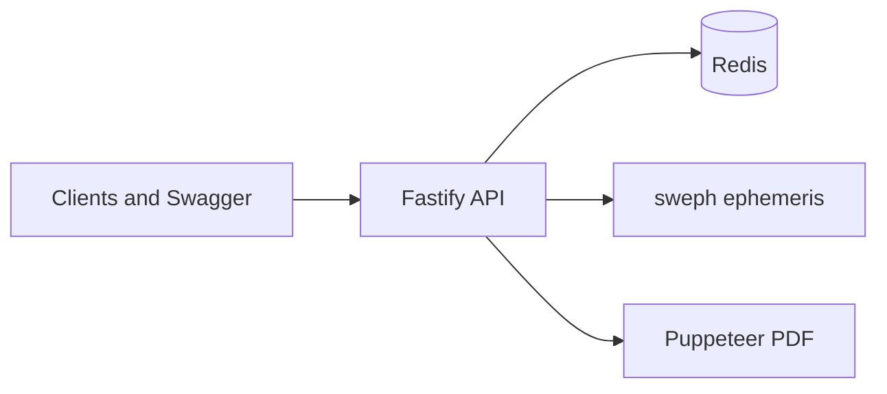

# Astryxion API — Astrology REST API & Ephemeris Backend

**Astryxion** is a **REST API for astrology**, horoscope content, and **birth chart (natal chart) calculations** — aimed at developers building apps, SaaS, or AI assistants that need reliable **astrological calculations over HTTP**.

It covers **Western tropical astrology** (planets, houses, aspects, **Swiss Ephemeris** precision), **Vedic / Jyotish** (nakshatras, dasha, vargas, and related routes — see OpenAPI for each endpoint’s coordinate model), **Chinese astrology** (**Ba Zi / Four Pillars**, zodiac, **Feng Shui**, I Ching), plus **Tarot**, **Runes**, numerology, and **astrology PDF reports**. The stack is a **single Fastify** service with **OpenAPI 3.1** (`info.version` matches **`package.json`**, currently **2.5.0**), **Zod** validation, **Redis** caching, rate limits, **HTTP natal LLM context** (`/api/v1/natal/llm-context`), and **MCP** tool discovery for agents.

**If you are searching for:** an **astrology API**, **horoscope API**, **natal chart API**, **synastry API**, **compatibility API**, **ephemeris API**, **Swiss Ephemeris API**, **Vedic astrology API**, **Jyotish API**, **Chinese zodiac API**, **BaZi API**, **Feng Shui API**, **solar return API**, **solar arc API**, or a **Tarot / I Ching API** — this repository is a full-stack style backend that combines those domains behind one OpenAPI surface.

[](https://nodejs.org/)
[](https://www.typescriptlang.org/)
[](https://fastify.dev/)
[](./LICENSE)

**Live demo:** _add your production URL here_  
**OpenAPI (local):** `http://localhost:3000/api/v1/openapi.json` · **Swagger UI:** `http://localhost:3000/docs`

### Keywords & typical searches

astrology api · horoscope api · birth chart api · natal chart rest api · natal svg api · llm astrology context xml · swiss ephemeris node · tropical astrology backend · vedic horoscope api · chinese astrology api · bazi calculator api · four pillars api · feng shui flying stars · synastry matchmaking api · solar arc directions · annual predictions api · astrology pdf generation · multilingual horoscope en pt es hi · developer astrology sdk openapi

---

## Why this project

| Area | What it demonstrates |
|------|----------------------|
| **Domain** | Serious date/time + ephemeris work (UTC, houses, aspects, solar terms). |
| **API design** | Consistent `/api/v1` routes, shared schemas, multilingual responses (`en`, `pt`, `es`, `hi`). |
| **Ops** | Redis-backed keys, daily rate limits with **429** + `Retry-After`, Prometheus metrics, health checks. |
| **Docs** | Swagger UI + machine-readable OpenAPI for SDK generation. |
| **Heavy lifting** | Native **sweph** bindings, **Puppeteer** PDF pipeline, optional Docker image with Chromium. |

---

## Tech stack

| Layer | Choices |
|-------|---------|
| Runtime | Node.js 22+, ESM (`"type": "module"`) |
| HTTP | Fastify 5, `@fastify/cors`, `@fastify/static`, `@fastify/swagger` + Swagger UI |
| Validation | Zod, `zod-to-json-schema` |
| Astronomy | **sweph** (Swiss Ephemeris) |
| PDF | Puppeteer (HTML → PDF), Sharp where needed |
| Cache / limits | **ioredis**, tagged cache invalidation, per-key daily quotas by tier |
| Observability | `prom-client` (`/metrics`), HTML status (`/status`, `/health`; JSON `components.chartSvg` on `/health`) |

---

## Feature map (selected endpoints)

### Western (tropical, Swiss Ephemeris) — natal & forecasting API

- `POST /api/v1/natal-chart` — **natal chart API**: planets, angles, **houses** (Placidus and other systems).
- `POST /api/v1/natal/llm-context` — same natal as JSON/XML **LLM-oriented** document (`response: "json"` wraps XML in `contextXml`, or `response: "xml"` for raw XML).
- `POST /api/v1/solar-return`, `POST /api/v1/synastry`, `POST /api/v1/annual-predictions`.
- `POST /api/v1/solar-arc` — true solar arc (Sun displacement, directed positions).
- Aspect pattern detection (e.g. Yod, Grand Cross, stellium) in the calculation pipeline.
- `POST /api/v1/chart/natal-svg` — **natal wheel SVG** (JSON `{ chart: "<svg>…" }` or raw `image/svg+xml` when `format: "svg"`). Options: `size`, `transparentBackground`, `includeAllBodies`, **`theme`** (`lavender`/`light`, `dark`, `minimal`), **`splitChart`** → `chartWheel` + `chartGrid`, **`drawWheelAspects`**, `gridWidth`.
- `POST /api/v1/chart/synastry-svg` — **two separate natal wheels** (`person1` / `person2`) for embedding; optional **`theme`**; inter-chart aspects remain on `POST /api/v1/synastry`.

### Vedic (Jyotish) — Indian astrology API

**Coordinate model:** most server-driven Vedic routes use **`calculatePlanets` / `calculateAscendant`** (tropical ecliptic, `SEFLG_MOSEPH`). `POST /api/v1/vedic-chart` applies a **linear ayanamsa approximation** (not Swiss Ephemeris Lahiri). Full route-by-route table: [`docs/VEDIC_COORDINATE_AUDIT.md`](./docs/VEDIC_COORDINATE_AUDIT.md).

- `POST /api/v1/vedic-complete`, `POST /api/v1/vedic/vargottama`, `GET /api/v1/nakshatras` (full nakshatra field i18n via `lang`), `POST /api/v1/nakshatra`, `POST /api/v1/dasha` — **Vedic astrology REST** endpoints.
- `POST /api/v1/remedies`, `POST /api/v1/yogas`, extended routes under `/api/v1/vedic/…`.

**Coverage note (vs focused Jyotish-only APIs such as [teal33t/jyotish-api](https://github.com/teal33t/jyotish-api)):** Astryxion exposes a **broad** Vedic surface (e.g. `vedic-complete`, `varga-analysis`, `panchanga`, `muhurta`, `shadbala`, `ashtakavarga`, Jaimini, Tajika, Nadi, Gochara, Prasna, and more — see OpenAPI). Gaps to consider if you need parity with specialist servers:

| Topic | Status in this repo |
|-------|---------------------|
| **Explicit “vargottama” flag** | Implemented: `vedicChart.vargottama` on `vedic-complete` and `POST /api/v1/vedic/vargottama` (see `methodology` for how D9 is modeled in this engine). |
| **Single-purpose Jyotish OpenAPI** | This project bundles Western + Chinese + esoteric; for “Jyotish-only” branding, document a curated route list for clients. |
| **Docker-first one-liner** | A [Dockerfile](./Dockerfile) exists; tune compose + Redis for self-hosted Jyotish stacks similarly to jyotish-api. |

### Chinese astrology & metaphysics API

- `POST /api/v1/chinese/zodiac` — **Chinese zodiac** / lunar calendar style inputs.
- `POST /api/v1/chinese/iching/consult`, `POST /api/v1/chinese/kua`.
- `POST /api/v1/chinese/bazi` — **Ba Zi (八字) / Four Pillars** (Li Chun & solar-term months; `timezoneOffsetMinutes` for hour pillar).
- `GET` / `POST` `/api/v1/chinese/feng-shui` — **Feng Shui** annual profile; optional **Flying Stars 9-palace** grid.

### Reports & esoteric (Tarot, Runes, I Ching)

- PDFs under `/api/v1/reports/…` — **astrology PDF API** (natal, matchmaking, **annual forecast PDF** with `lang` + Redis cache).
- **Tarot API**, Runes, **I Ching** oracle, numerology, palmistry (full list in OpenAPI).

### Developer surfaces

- **`/docs`** — Swagger UI (Bearer auth).
- **`/portal`**, **`/dashboard`**, **`/admin`** — HTML tooling (keys, tiers, ops).
- **`/api/mcp/list_tools`** + **`POST /api/mcp/call_tool`** — MCP integration (`INTERNAL_SECRET` required for `call_tool` in production; local dev uses an in-process fallback if unset).
- **`POST /api/v1/natal/llm-context`** — same natal engine as `/natal-chart`, serialized as XML for LLM prompts (complements MCP when you do not use an agent runtime).

---

## Architecture (high level)



Static **landing** pages ship from the `landing/` folder via `@fastify/static` on the same process.

---

## Quick start (local)

**Prerequisites:** Node.js **22+**, Redis (optional in dev; **required** in production), and a C++ build toolchain if `npm install` must compile **sweph** on your OS.

```bash
git clone <your-repo-url>
cd "your-project-folder"
cp .env.example .env
# Edit .env — at minimum set sensible secrets if you mimic production
npm ci
npm run dev
```

Default port: **`3000`** (override with `PORT`).

| Script | Purpose |
|--------|---------|
| `npm run dev` | Watch mode with `tsx` |
| `npm run build` | Compile to `dist/` |
| `npm start` | `prestart` builds, then `node dist/index.js` |
| `npm test` | Node test runner + TSX (aspect patterns, Ba Zi reference, production hardening, chart SVG helpers) |
| `npm run typecheck` | `tsc --noEmit` |

### Try the API

```bash
curl -s "http://localhost:3000/api/v1/horoscope/aries" \
  -H "Authorization: Bearer dev_test_key"
```

In **non-production** `NODE_ENV`, the literal `dev_test_key` is accepted as **admin** for local Swagger and scripts. In **production**, use **`SWAGGER_SANDBOX_API_KEY`** (limited tier) or real keys from the portal — see [Production configuration](#production-configuration).

### More examples (natal JSON + SVG wheel)

**cURL — full natal chart (JSON body, avoids `+` in URLs)**

```bash
curl -s -X POST "http://localhost:3000/api/v1/natal-chart" \
  -H "Authorization: Bearer dev_test_key" \
  -H "Content-Type: application/json" \
  -d '{"date":"1993-08-06","timeUtc":"20:50:00","latitude":-33.41167,"longitude":-70.66647,"houseSystem":"placidus"}'
```

**cURL — SVG wheel only (`format: "json"` returns a string in `chart`)**

```bash
curl -s -X POST "http://localhost:3000/api/v1/chart/natal-svg" \
  -H "Authorization: Bearer dev_test_key" \
  -H "Content-Type: application/json" \
  -d '{"date":"1993-08-06","timeUtc":"20:50:00","latitude":-33.41167,"longitude":-70.66647,"houseSystem":"placidus","size":400,"transparentBackground":false,"format":"json"}'
```

**JavaScript (fetch)**

```javascript
const API = "http://localhost:3000";
const headers = { Authorization: "Bearer dev_test_key", "Content-Type": "application/json" };
const payload = {
  date: "1993-08-06",
  timeUtc: "20:50:00",
  latitude: -33.41167,
  longitude: -70.66647,
  houseSystem: "placidus",
};
const natal = await fetch(`${API}/api/v1/natal-chart`, {
  method: "POST",
  headers,
  body: JSON.stringify(payload),
}).then((r) => r.json());
const svgRes = await fetch(`${API}/api/v1/chart/natal-svg`, {
  method: "POST",
  headers,
  body: JSON.stringify({ ...payload, format: "json" }),
}).then((r) => r.json());
// svgRes.chart is an SVG string — use DOMParser or data URLs; sanitize if embedding untrusted SVG
```

**Python (`requests`)**

```python
import requests
API = "http://localhost:3000"
headers = {"Authorization": "Bearer dev_test_key", "Content-Type": "application/json"}
payload = {
    "date": "1993-08-06",
    "timeUtc": "20:50:00",
    "latitude": -33.41167,
    "longitude": -70.66647,
    "houseSystem": "placidus",
}
r = requests.post(f"{API}/api/v1/natal-chart", json=payload, headers=headers, timeout=60)
r.raise_for_status()
print(r.json().keys())
```

**cURL — split wheel + tabular grid (`chartWheel` / `chartGrid`)**

```bash
curl -s -X POST "http://localhost:3000/api/v1/chart/natal-svg" \
  -H "Authorization: Bearer dev_test_key" \
  -H "Content-Type: application/json" \
  -d '{"date":"1993-08-06","timeUtc":"20:50:00","latitude":-33.41167,"longitude":-70.66647,"houseSystem":"placidus","splitChart":true,"theme":"dark","format":"json"}'
```

**cURL — natal context for LLMs (JSON envelope with `contextXml`)**

```bash
curl -s -X POST "http://localhost:3000/api/v1/natal/llm-context" \
  -H "Authorization: Bearer dev_test_key" \
  -H "Content-Type: application/json" \
  -d '{"date":"1993-08-06","timeUtc":"20:50:00","latitude":-33.41167,"longitude":-70.66647,"houseSystem":"placidus","maxAspects":40,"response":"json"}'
```

**PHP**

```php
<?php
$payload = json_encode([
  "date" => "1993-08-06",
  "timeUtc" => "20:50:00",
  "latitude" => -33.41167,
  "longitude" => -70.66647,
  "houseSystem" => "placidus",
]);
$ctx = stream_context_create([
  "http" => [
    "method" => "POST",
    "header" => "Authorization: Bearer dev_test_key\r\nContent-Type: application/json",
    "content" => $payload,
  ],
]);
echo file_get_contents("http://localhost:3000/api/v1/natal-chart", false, $ctx);
```

**Go**

```go
body := strings.NewReader(`{"date":"1993-08-06","timeUtc":"20:50:00","latitude":-33.41167,"longitude":-70.66647,"houseSystem":"placidus"}`)
req, _ := http.NewRequest("POST", "http://localhost:3000/api/v1/natal-chart", body)
req.Header.Set("Authorization", "Bearer dev_test_key")
req.Header.Set("Content-Type", "application/json")
resp, err := http.DefaultClient.Do(req)
```

**React / Vue (browser `fetch`)** — same shape as the JavaScript example above; keep the API key on a **backend** proxy in production (never embed production keys in client bundles).

### Dates, time zones, and `timeUtc`

- Prefer **`POST` with a JSON body** for birth data. Putting ISO-8601 strings with a **`+`** time-zone offset in **query strings** often breaks encoding (the `+` becomes a space); see common pitfalls in projects like [ryuphi/astrology-api](https://github.com/ryuphi/astrology-api).
- This API expects **`date`** as `YYYY-MM-DD` and **`timeUtc`** as civil time on that calendar day in **UTC** (e.g. `20:50:00`). Convert from local time on the client before calling.

### Swiss Ephemeris house systems exposed by this API

These slugs are accepted on natal / chart routes (mapped to Swiss `houses_ex2` letters):

| API `houseSystem` | Swiss `hsys` | Common name |
|-------------------|--------------|-------------|
| `placidus` | P | Placidus |
| `koch` | K | Koch |
| `equal` | E | Equal |
| `whole_sign` | W | Whole sign |
| `regiomontanus` | R | Regiomontanus |
| `campanus` | C | Campanus |
| `porphyry` | O | Porphyry |
| `alcabitius` | B | Alcabitius |

Swiss Ephemeris supports additional letters (e.g. solar, topocentric variants); they are **not** all wired in this codebase yet. See [Swiss Ephemeris programmer’s reference](https://www.astro.com/swisseph/swephprg.htm).

### Minimal “ephemeris-only” routes (no houses)

If you only need **planet longitudes** for a UTC instant (no ascendant / cusps):

- `GET /api/v1/planets?date=YYYY-MM-DD&timeUtc=HH:mm:ss`
- `POST /api/v1/natal/planets` with `{ "date", "timeUtc", "latitude", "longitude" }` (latitude/longitude are accepted for API symmetry; positions are still geocentric ecliptic for that time).

For **houses + aspects**, use `POST /api/v1/natal-chart`.

### Why calculate on the server?

Ephemeris math, house systems, and aspect orbs are easy to get subtly wrong across clients. A single **Node + sweph** deployment gives one audited implementation, stable **OpenAPI** contracts, and simpler mobile or web apps (they send birth data; you return JSON, SVG, or LLM context).

### Projects using Astryxion

_Add your product or open-source client here via PR._

---

## Internationalization

Supported languages: **English**, **Portuguese**, **Spanish**, **Hindi**.

Use `Accept-Language` and/or the `lang` query/body field where the route defines it (`en` | `pt` | `es` | `hi`).

---

## Production configuration

When **`NODE_ENV=production`**, startup **fails** unless these are set and meet length rules:

| Variable | Role |
|----------|------|
| `REDIS_URL` | API key storage, rate limits, cache (e.g. Upstash). |
| `API_KEY_HASH_SECRET` | ≥ 32 chars — HMAC for API keys, password peppering. |
| `INTERNAL_SECRET` | ≥ 32 chars in **production** — `x-internal-secret` for MCP inject and `/portal` sandbox proxy. If unset in dev, a built-in fallback is used (see `getResolvedInternalSecret` in `env-validation.ts`). |

**Recommended optional**

| Variable | Role |
|----------|------|
| `SWAGGER_SANDBOX_API_KEY` | ≥ 16 chars if set — safe demo key for `/docs` (`SWAGGER_SANDBOX_TIER`: `free` \| `mercury` \| `venus` \| `saturn`, default `mercury`). |
| `INTERNAL_CRON_TOKEN` | `x-internal-token` for `POST /api/v1/internal/horoscope-refresh`. |
| `SWEPH_EPHE_PATH` | Custom ephemeris file path. |
| `PUPPETEER_EXECUTABLE_PATH` | System Chromium (Dockerfile uses `/usr/bin/chromium`). |

**Rate limits:** enforced per key per day when Redis is available; **admin** tier skips counting; over limit → **429** + `Retry-After`.

**Operations (Redis backups, monitoring, alerts):** see [docs/OPERATIONS.md](./docs/OPERATIONS.md). Optional: set `METRICS_BEARER_TOKEN` to require auth on `GET /metrics`.

**Legacy:** `ALLOW_LEGACY_DEV_TEST_KEY=1` allows literal `dev_test_key` in production — avoid on the public internet.

Full list: [`.env.example`](./.env.example).

---

## Deploy

This is a **long-running Node** app with **native addons** and **headless Chrome** for PDFs. Typical targets: **Railway**, **Fly.io**, **Render**, **Google Cloud Run** (container), etc.

**Render.com:** use the [Blueprint](./render.yaml) (Docker web service). On first deploy, set `REDIS_URL` in the dashboard (Render Key Value or **Upstash** with `rediss://…`). The Dockerfile copies `ephe/` and sets `SWEPH_EPHE_PATH=/app/ephe`. Health check: `GET /health`.

### Production checklist (env · Redis · uptime · metrics)

1. **Environment** — In the host dashboard, set at least: `REDIS_URL`, `API_KEY_HASH_SECRET`, `INTERNAL_SECRET`, `NODE_ENV=production`. See [`.env.example`](./.env.example). With the Render Blueprint, `API_KEY_HASH_SECRET`, `INTERNAL_SECRET`, and **`METRICS_BEARER_TOKEN`** are auto-generated unless you already have values.
2. **Redis** — Use a managed instance (e.g. Upstash, Render Key Value). In the provider UI, **turn on backups / snapshots** if your plan supports it. Details: [docs/OPERATIONS.md](./docs/OPERATIONS.md).
3. **Uptime** — Render already hits **`/health`** for the service health check. For extra alerts, use an external monitor (Better Stack, UptimeRobot, etc.) on `https://your-domain/health` with header `Accept: application/json`. Optionally set GitHub repository variable **`HEALTHCHECK_URL`** to that URL to run [`.github/workflows/health-check-scheduled.yml`](.github/workflows/health-check-scheduled.yml) hourly.
4. **Metrics** — With the Blueprint, **`METRICS_BEARER_TOKEN`** is generated: call `GET /metrics` with `Authorization: Bearer <token>` or header `X-Metrics-Token`. Self‑hosted / no Blueprint: set `METRICS_BEARER_TOKEN` yourself or block `/metrics` at the proxy.

```bash
docker build -t astryxion-api .
docker run --env-file .env -p 3000:3000 astryxion-api
```

Allocate **~1–2 GB RAM** if you rely on PDF generation.  
**CI:** [`.github/workflows/ci.yml`](.github/workflows/ci.yml) runs `npm ci`, `npm test`, and `npm run build`.

---

## OpenAPI and SDKs

```bash
npx @openapitools/openapi-generator-cli generate \
  -i http://localhost:3000/api/v1/openapi.json \
  -g typescript-axios \
  -o ./sdk
```

---

## Repository layout (abbreviated)

```
src/
  index.ts              # App bootstrap, auth hook, rate limit, static + routes
  lib/                  # auth, cache, pdf-engine, chart-svg-api, natal-llm-context, vedic-vargottama, env-validation, utils
  routes/               # Feature routers (incl. chart-svg.ts)
  chinese-astrology/    # Ba Zi, Feng Shui routes + engine
  services/             # Calculation and domain services
landing/                # Marketing / features HTML
docs/                   # Technical notes (e.g. Vedic coordinate audit)
```

---

## Security highlights

- **Playground:** In **production**, the HTML does **not** ship a default API key; users enter a key from `/portal` (saved only in the browser). In development, `dev_test_key` is still used as a convenience when the server allows it.
- **Production:** `INTERNAL_SECRET` must be set (≥ 32 chars) for internal inject headers. **Non-production:** a dev fallback applies when unset so the portal sandbox and MCP `call_tool` work out of the box.
- Production **validates** critical env vars before listening.
- **Sandbox** Swagger key is separate from **admin**; production docs encourage portal keys.

---

## License

**Proprietary — all rights reserved.** No use, copying, distribution, or commercial exploitation is permitted without a written agreement from the copyright holder. See [`LICENSE`](./LICENSE). Release notes: [`CHANGELOG.md`](./CHANGELOG.md).

---

&copy; 2026 Astryxion Celestial Technologies. Built for the modern esoteric web.
